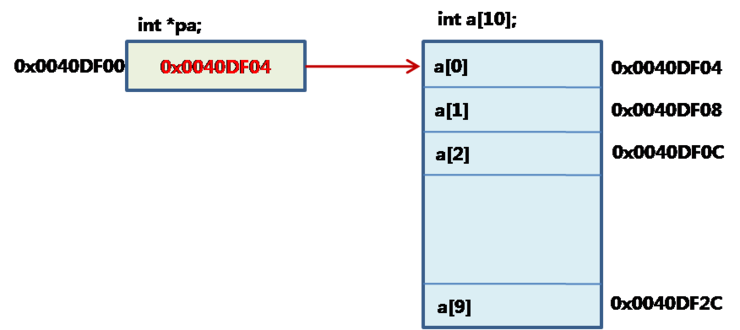

# 포인터

## 포인터 (프로그래밍)

https://ko.wikipedia.org/wiki/포인터_(프로그래밍)

<aside>
💡 포인터(pointer)는 프로그래밍 언어에서 다른 변수, 혹은 그 변수의 메모리 공간주소를 가리키는 변수를 말한다. 포인터가 가리키는 값을 가져오는 것을 역참조라고 한다.
포인터는 어셈블리어, C, C++, 파스칼 등 하위 레벨까지 제어할 수 있는 언어에서 주로 많이 쓰이며, 모듈라-2, 에이다와 같은 언어에서는 극히 제한적으로 사용되고, 자바, 에펠 등에서는 완전히 숨겨져 사용할 수 없다.
첫 번째 부류의 언어에서는 포인터를 메모리의 임의의 주소를 가리키도록 할 수 있으며 포인터의 연산도 가능하다.
일반적으로 포인터는 메모리 주소로 바꿀 수 있다. 다른 변수나 함수를 가리키도록 사용된다.

</aside>




### 주소값의 이해

데이터의 주소값이란 해당 데이터가 저장된 메모리의 시작 주소를 의미합니. C언어에서는 이러한 주소값을 1바이트 크기의 메모리 공간으로 나누어 표현합니. 예를 들어, int형 데이터는 4바이트의 크기를 가지지만, int형 데이터의 주소값은 시작 주소 1바이트만을 가리킵니다.

## 포인터란?


C언어에서 포인터(pointer)란 메모리의 주소값을 저장하는 변수이며, 포인터 변수라고도 부릅니다. char형 변수가 문자를 저장하고, int형 변수가 정수를 저장하는 것처럼 포인터는 주소값을 저장합니다.

```c
int n = 100; // 변수 선언
int *ptr = &n; // 포인터의 선언
```

### 왜 포인터를 사용하나요?

위의 위키백과 정의를 살펴보면, *포인터는 어셈블리어, C, C++, 파스칼 등 하위 레벨까지 제어할 수 있는 언어에서 주로 많이 쓰이며* 라고 되어있습니다. 한 마디로 표현하자면, 메모리에 저장된 변수를 사람이 직접 건드리기 위해서 사용한다고 할 수 있습니다. 어셈블리, C, C++ 등 상대적으로 오래된 언어들이 개발될 당시에는 지금처럼 16GB 짜리 메모리가 없던 시절이었습니다. 즉, 효율적으로 메모리 관리를 하지 못하면 결국 메모리에 빈공간이 없어지게 되고 프로그램이 멈추는 일이 많았습니다. 이러한 이유로 메모리를 직접 컨트롤 할 수 있게끔 하고자 하는 니즈가 존재했고 그 니즈에 맞춰서 설계되었다고 보면 됩니다. 참고로, 8GB, 16GB 등등 그 램을 메모리라고 합니다. 참고로 우리가 메모리라고 하면 주로 하드디스크나 SSD를 생각하게 되는데 주로 컴퓨터 공학 쪽에서는 그러한 저장 장치들을 IO Disk 혹은 ROM 이라고 부르고 메모리는 RAM이라고 아시면 됩니다.


위의 그림을 보죠. **alphabet_pointer** 라는 데이터 구조가 하나 존재하고, **alphabet** 이라는 데이터 구조가 하나 존재합니다. 그리고 그 둘은 [address, contents] 라는 두 공간으로 나뉘어져 있습니다. 네모로 되어 있는 부분은 메모리에 데이터가 담겨있는 형태라고 보면 됩니다. 아까 포인터는 직접 메모리를 제어하기 위한 녀석이라고 했죠? 제어하기 위해서는 그 메모리를 접근할 수 있어야 합니다. 접근할 수 있다는 말은 메모리의 주소를 알아야 한다는 것입니다. 주소? 뭔가 감이 안옵니다. 일상 생활을 예로 들어보죠. 우리가 강남에 있는 플레이데이터 사옥으로 가야한다고 가정해봅시다. 사옥을 목적지로 하여 네이버 지도나 카카오맵 등을 사용하여 경로를 알아야 갑니다. 근데 사옥의 주소를 모르면 갈 수가 없습니다. 메모리도 똑같습니다. 모든 메모리에는 각자의 고유한 주소가 지정되어 있습니다. 마치 건물들의 주소처럼 말이죠. 따라서 위의 그림과 같은 형태가 나타나게 됩니다. 메모리라는 공간에 어떤 값(contents)을 담을건데, 그 공간의 주소(address)가 기록되어 있는 형태인 것이죠.

여기서 포인터의 개념을 찾을 수 있습니다. 우리가 특정 배열을 선언한다고 하죠.

```python
alphabet = ['a','b','c','d', 'e']
# a[0] = 'a'
```

포인터를 사용하는 언어 뿐만 아니라 대부분의 언어에서는 배열에 접근할 때, 배열의 가장 첫 번째 데이터 즉, **`‘a’`**를 먼저 접근합니다. 그러면 아까 접근하기 위해서 필요한 것이 뭐라고 했었죠? 바로 변수를 담고있는 배열의 주소입니다. 그럼 주소는 그냥 접근하는 것일까요? 아닙니다.  주소 또한 어딘가에 저장되어야 하는 것이죠. 그래서 만들어진 개념이 포인터입니다. `alphabet_pointer`를 보면 `contents`에 담긴 값은 바로 `alphabet`의 `address`를 가리키고 있는 것(동일한 것)을 볼 수 있습니다. 그리고 `alphabet`의 `address`를 자세히 한 번 보죠. 1씩 증가하는 것이 보입니다(2e → 2f → 30 → 31 → 32). 참고로 메모리 주소 값은 16진수로 표현합니다. 그 이유는 다음의 링크를 참고해주세요([https://80000coding.oopy.io/fbebe8bd-620e-41bb-86c4-ab0f580e6f10](https://80000coding.oopy.io/fbebe8bd-620e-41bb-86c4-ab0f580e6f10)). 우리가 도로명 주소를 봐도, 도로를 따라서 바로 옆에 붙어있는 집은 순차적으로 숫자가 증가합니다. 메모리도 똑같습니다. 바로 다음의 메모리에 담겨있다는 것이지요. 통상적으로, 메모리의 주소가 없다면 `‘a’`다음에 `'b'`에 어떻게 접근해야할지 막막합니다. 하지만, 포인터의 경우 이러한 부분이 매우 쉬워지죠. 단순히 `alphabet_pointer`의 `contents` 값을 1만 증가시켜주고 그 메모리에 담긴 변수를 가져오면 되니까요.

### 포인터는 어렵다

맞습니다. 어려워요. 절대 쉬운 개념도 아닐 뿐더러, 사실 파이썬을 주로 사용하는 우리가 많이 사용하는 개념은 아닙니다. 하지만 파이썬이라는 언어도 결국에는 메모리에 접근해야하기 때문에 내부적으로는 위와 같은 일이 일어납니다. 단지 우리가 쉽게 그 과정을 볼 수 없을 뿐이죠. 심지어 C언어를 배우면서 사람들이 프로그래밍을 가장 많이 포기하는 부분이 이 포인터이기도 합니다. 따라서 *위의 내용을 내가 달달 외워야지* 라는 마음보다는, *아 메모리 안에서는 저런 일이 일어나는구나. 내가 몰라도 되게 해줘서 감사합니다 파이썬님* 이라고 생각하면서 메모리에 대한 개념을 잡는 정도로만 내용을 활용하셔도 좋습니다.